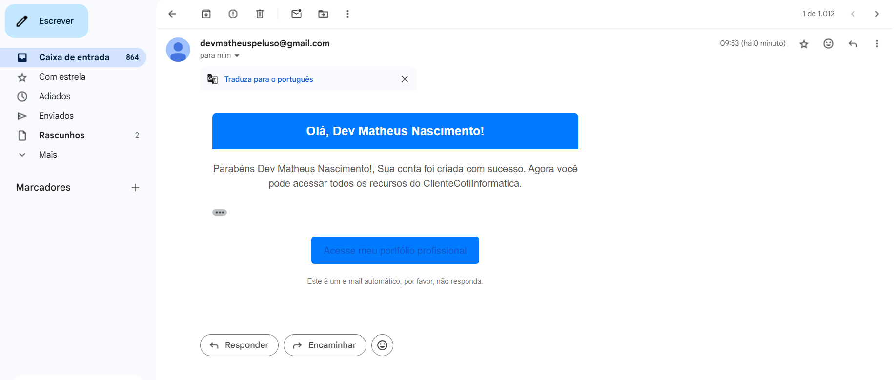

# API de Envio de Mensagens de Email

 
 
 
 
 
 

## Descrição Sobre o Projeto
Esta API consome mensagens de uma fila do RabbitMQ e envia emails conforme as mensagens recebidas. Este projeto trabalha em conjunto com a [Clientes API](https://github.com/matheuspeluso/ClientesApi_CRUD-de-cliente-e-enviando-dados-para-fila-de-rabbitmq).


## Dependencias do projeto
- Jdk 21
- spring-boot-starter-web
- spring-boot-starter-data-jpa
- spring-boot-devtools
- lombok
- spring-boot-starter-test
- spring-boot-starter-validation
- spring-boot-starter-amqp
- spring-rabbit-test
- spring-boot-starter-mail

## Pré-requisitos para rodar o projeto via docker

- Docker
- Docker Compose
- Projeto ClientesAPI_CRUD clonado e rodando via docker: [Clientes API](https://github.com/matheuspeluso/ClientesApi_CRUD-de-cliente-e-enviando-dados-para-fila-de-rabbitmq).

## Clonando o Repositório
Para clonar o repositório, execute o seguinte comando no terminal:

```bash
git clone https://github.com/matheuspeluso/apiEmailMessage-consumindo-fila-RabbitMQ-e-envio-de-email.git
```
Acessando a pasta raiz do projeto
```bash
cd apiEmailMessage-consumindo-fila-RabbitMQ-e-envio-de-email
```

Com o projeto [Clientes API](https://github.com/matheuspeluso/ClientesApi_CRUD-de-cliente-e-enviando-dados-para-fila-de-rabbitmq) clonado e rodando em sua maquina, cadastre algum cliente para que a fila do rabbitmq seja iniciada antes de rodar a ApiEmailMessage , apos tudo feito basta abrir o terminal do CMD na pasta raiz do projeto ApiEmailMessage, onde se encontra o arquivo docker-compose.yml e rodar o seguinte comando :

```bash
 docker-compose up --build
```

## Desenvolvido por 
- [Dev Matheus Peluso](https://github.com/matheuspeluso)
- [Linkedin](https://www.linkedin.com/in/devmatheuspeluso/)
- [Whatsapp](https://wa.me/5521993857520?text=Ol%C3%A1%20Matheus%20vim%20pelo%20seu%20GitHub!%20)